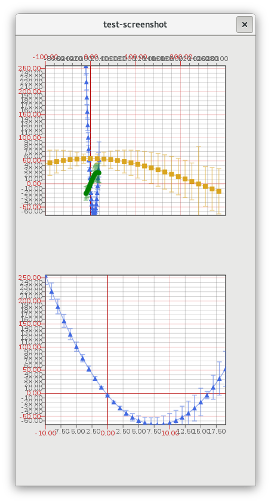

## goatplot

[](https://gitter.im/drahnr/goatplot?utm_source=badge&utm_medium=badge&utm_campaign=pr-badge&utm_content=badge)

Plotting library for Gtk+ 3.x using cairo.

#### Status

The basics are working, one can plot arbitrary 2D data with various plotting styles.

There are a few open points remaining, listed in under [enhancements](https://github.com/drahnr/goatplot/issues?q=is%3Aissue+is%3Aopen+label%3Aenhancement).

*Recommendation: Just see if the demos provide what you are looking for.*




### Build

To build the library and the demo just do
```bash
./waf configure debug -j2
```

For automated building i.e. in order to create a RPM package use
```
./waf configure --prefix=/usr build install --destdir=/tmp --notests --no-glade-dtd-check
```
as is used in `./meta/goatplot.spec.in`.

_Note_: The use of `build` instead of `release`/`debug`, which does not inject any additional `CFLAGS` but only uses those from the environment.

_Note_: The demo will launch, a screenshot is created, the demo closes, this is expected behaviour and the demo can be launched again manually.
